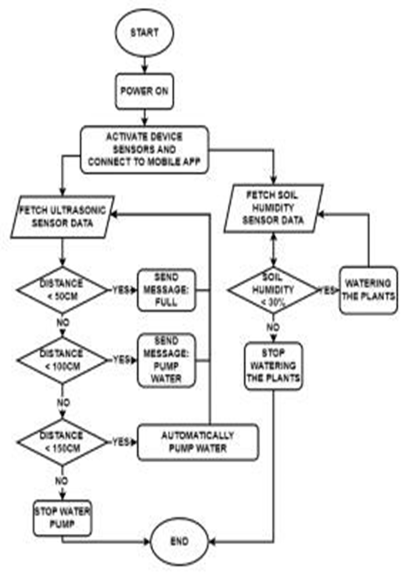
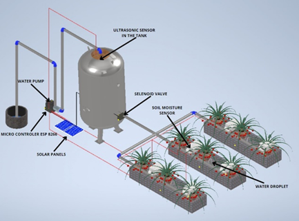
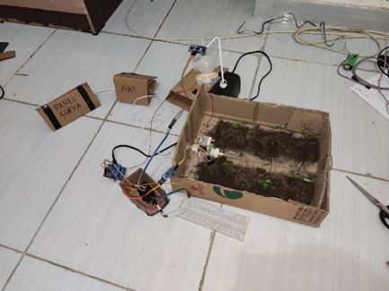
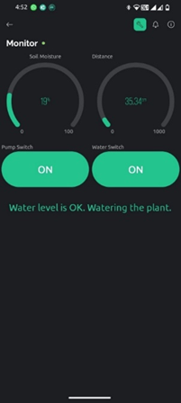
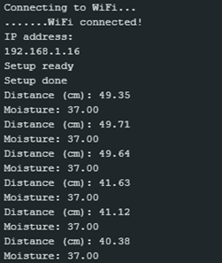

# Smart Irrigation System IoT with Blynk 🌱💧

> Proyek ini dikembangkan oleh **Klub Riset dan Teknologi Kampus 4 POLIJE**  
> Sistem irigasi pintar berbasis IoT yang menggunakan **Blynk**, **ESP8266**, dan **sensor load cell** untuk otomatisasi penyiraman dan pemantauan kondisi tanah.

## 📌 Deskripsi Proyek
Proyek ini bertujuan untuk menciptakan sistem irigasi cerdas yang dapat dikendalikan melalui aplikasi **Blynk**. Sistem ini mampu:
- Mendeteksi kadar air tanah secara real-time  
- Mengaktifkan pompa air secara otomatis  
- Memantau data sensor dari jarak jauh  

---

## 📸 Dokumentasi Proyek

### 🏗️ Desain Sistem  
Representasi arsitektur keseluruhan dari sistem irigasi pintar ini.  

### 🔄 Flowchart Sistem  
Diagram alur kerja dari sistem.  

### 🎨 Desain 3D  
Model 3D dari perangkat keras yang digunakan.  

### 📱 Prototype  
Tampilan prototype sistem yang telah dibuat.  

### 📊 Dashboard Blynk  
Antarmuka di aplikasi **Blynk** untuk memantau dan mengontrol sistem.  

### 📑 Data Hasil Pengujian  
Dokumentasi hasil pengujian dari sistem.  

---

## ⚙️ Teknologi yang Digunakan  
- **Hardware:** ESP8266, Sensor Load Cell, Pompa Air, Relay  
- **Software:** Arduino IDE, Blynk, Telegram Bot  

---

## 📌 Cara Menggunakan  
1. **Upload kode ke ESP8266** menggunakan Arduino IDE  
2. **Koneksikan perangkat ke aplikasi Blynk**  
3. **Lihat data sensor dan kontrol pompa** secara real-time  

---

## 🤝 Kontribusi  
Jika ingin berkontribusi, silakan fork repository ini dan buat pull request!  

💡 *Dikembangkan oleh Klub Riset dan Teknologi Kampus 4 POLIJE*  
